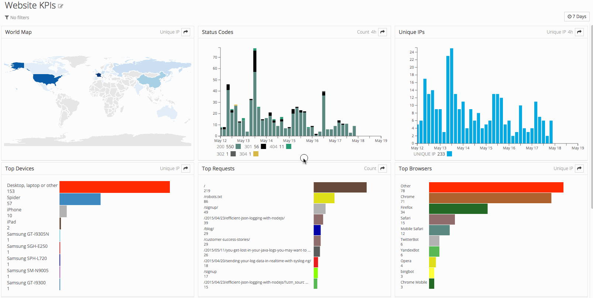

### How Canopius leveraging data and analytics to build a risk-smart and profitable portfolio while making a smooth transition to digital insurance.

#### Problem and Opportunity

*Canopius, just like any other insurance company, collects data because the sector is data-driven. They were considering innovating their workflow, moving from the traditional way of doing insurance to digital. This is also the future according to many experts. Conopius had domain knowledge but lacked the technical expertise to take full advantage of the data they had been collecting. This project paved the way for full implementation advanced analytics and digitalization.*

#### *Task*

* Prove that advanced analytics adds value to Canopius as a business and its clients.
* Use Analytics provide evidence for decision-making, Underwriting in way that it's better than the traditional way.

#### *My approach: What I did and Why*

I used Tableau, Excel, R, QGIS and statistics to extract value from Canopius data assets. This led to a better understanding of their risks, costs and informed decision making (e.g. Price optimization). The analysis was significant because it involved both historical and geographical components, thus helping learning insights and answering the question across time and space.

The Analysis involved not an only historical component, but geographical also to help gain insight both cross time and space. Using R, Excel, QGIS, and Tableau I leveraged Geographical Information Systems and Statistics to draw conclusions from the data and present the results in many formats such as graphs, dashboards, and maps as stand-alone products or within a report. 

More also involved data interacting with SQL database both for downloading the data for the analysis and storing data that I cleaned coming from multiple sources (unclean) so that could be used by another member of the team without any problem. This work has helped Canopius base their business decisions and pricing models on actual data instead of actuarial tables while reducing uncertainty.

*The above figure shows a data tool for tracking website KPIs (Courtesy of Tableau). This the kind of tools I build but because of data sensitivity issues, I could not use the original products.*

#### *Results- componetns of the project and outcomes:*

* Claims reclassification: attribute the reason for the claims into a specific rule according to rules that I created to automate this process. This helped Canopius understand what factors account for most claims, and where State, County, and ZipCode are they coming from. I used SQL, R, and Excel for this task.

* Lakeside Flood and Dam break Analysis: Understand how well flood maps were representing the risk. I used GIS to evaluate the risk concerning a property. This informed Canopius of which areas to write and not the policy. Moreover, it was also used in the competitiveness report.

* Competitiveness: Loss Ratio and Damage Ratio across the portfolio, to understand which factors have a significant impact on these two key variables. These two factors also provided insight into how well the business is doing and where, as well as the geographies with reasonable risk. thus, leading to smart underwriting, the understanding risk associated with a policy and spreading it in the portfolio. From this and lakeside analysis resulted in the selection of the list of risks that I client request to inform where they should write.

* Geocoding performance: Using GIS, I evaluate the performance of the different geocoding providers. This helped Canopius decide on the best one. This is significant for the underwriting the higher the hit rate the better the understanding of the risk.

* Rating Engine and Binder comparison: Automate price quote for underwriting team by including the guidelines into Excel application. This helped underwriter save time. no need to make the calculations to estimate pricing each time. they can rely on the model.
Comparison some between Canopius' rating engine pricing and existing prices that have been charged on a contract. This helps them understand if their pricing reflects the data, how comparable with the competition.

* Data Augmentation: Use Open Source for PC insurance in the US marker. Use it as the baseline for the competitor analysis against every variable influencing insurance product performance. this was like validation for what the company was doing.

#### *Rusuts summary:*

* price optimazation relying on the data instead of actuarial tables
* real understadning of the risk in the prtfolio
* Effiency in perfomance
* Increased hit rate
* validation for fully integration
* New Leads 

#### *take away*
- Not only build a cool solution, but one adds value to the company
- SWOT analysis to evaluate the business value of the data tools
- Critique my work, and ask others to review my work. This is particularly, important for a high stake project that a minor mistake could cost the company lots of money.
- Always get rid of the technical jargon when communicating the findings and be succinct 
- Always keep your research in archives, you will need it

