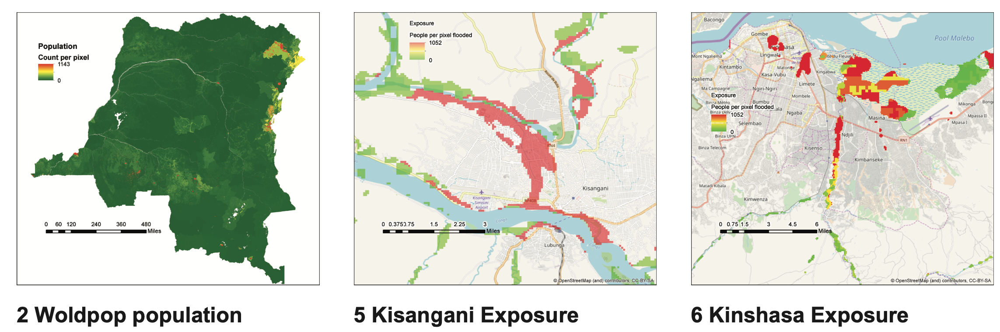
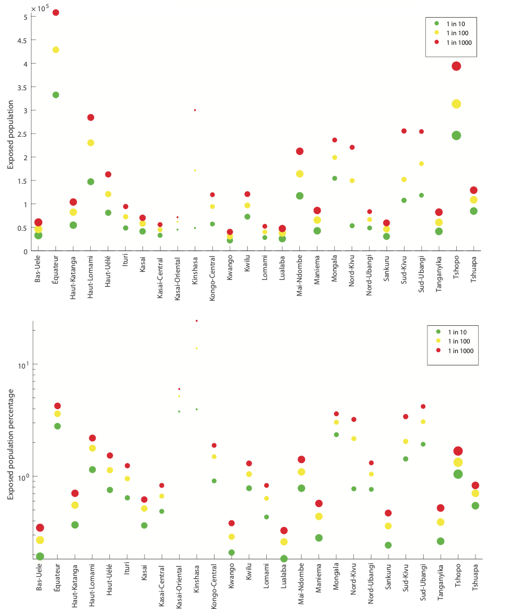

### *Using Data and Analytics to assesses flood risk areas in Congo, and Desing Systems and Thinking (DST) to design response. This is a project were analytics and Desing Systems and Thinking met to deliver value*

#### *Background*
*In the face of many flash flood in the DRC, the University of Bristol in Partnership with Fathom Global and CRuHM research group took on the challenges of providing a scientific understanding of the phenomena, and suggest ways to better respond and build resilience.*

#### *Task*
- Provide evidence to support risk assessment and flood management 

#### *My Approach* 

*I used Excel, R, GIS, and Tableau for data processing, analysis, and visualizations*
the following is the breakdown of the tasks and the reasoning behind:

- Data Gathering and Cleaning - the quality of the model depend on the quality of the data. therefore identifying the correct data source and cleaning them was crucial

- Geospatial modeling and analysis - Evaluate the flood simulated flood extent to classify risk zones

- Exposure Calculations - estimate the number of people exposure by flood return period and magnitude

- Damage Curves - estimate the damages to the infrastructure and property associated with the flood hazard

- Data Visualization - to communicate the complex information in a simple way

- Design System and Thinking to design recommendations

#### *Outcoomes* 

My project was one of the key studies on flood risk assessment in the Congo and informed risk assessment of thereof. My supervisors were impressed with my work, which was published on the Chapman Conference on Hydrology in the USA. 

Figure 1 shows: (2) distribution of population in Congo, (2,3) Risk Zone by flood depth in Kisangani and Kinshasa. Thus,highlighiting the most volnerable areas for an event of such magnitute.

Figure 2 shows the number of people exposed to the flood by province for different flood magnitude. Excluding the damages in infrastructure.

#### *Take away*
- I learned that cleaning and the context for the data are a must for analysis with quality and better outcomes.  
- Best visualizations are those that easily communicate complex ideas, that is, they make it easy for the audience to understand. They should be made taking into account the audience.
- Design Systems and Thinking is a transferable tool, useful when uncertainty is high.
- human-centered Desing help to validate solutions from scientific models

